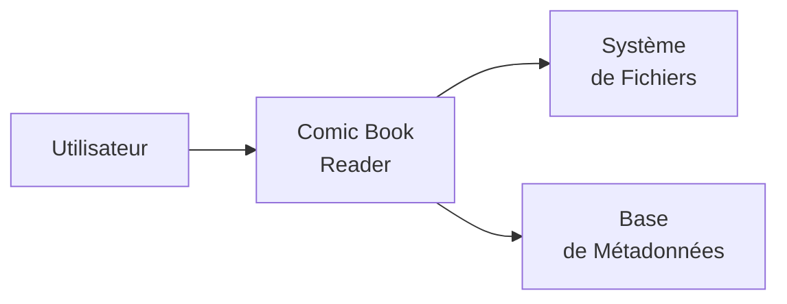

```mermaid
flowchart LR
    %% Acteurs Primaires (côté gauche)
    A[Utilisateur] -->  App

    %% Application (boîte noire centrale)
    App[Comic Book
    Reader] 

    %% Acteurs Secondaires (côté droit)
    App --> B[Système 
    de Fichiers]
    App --> C[Base 
    de Métadonnées]
```