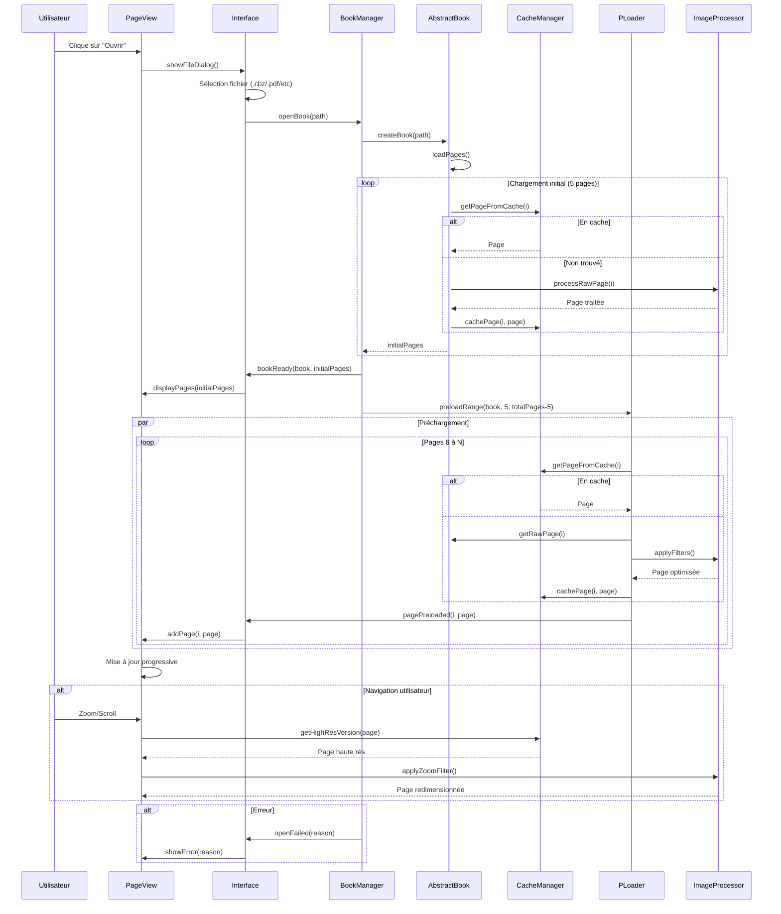

```mermaid
sequenceDiagram
    participant User as Utilisateur
    participant PageView
    participant UI as Interface
    participant BookManager
    participant Book as AbstractBook
    participant CacheManager
    participant PLoader
    participant ImageProcessor

    User->>PageView: Clique sur "Ouvrir"
    PageView->>UI: showFileDialog()
    UI->>UI: Sélection fichier (.cbz/.pdf/etc)
    UI->>BookManager: openBook(path)
  
    BookManager->>+Book: createBook(path)
    Book->>Book: loadPages()
  
    loop Chargement initial (5 pages)
        Book->>CacheManager: getPageFromCache(i)
        alt En cache
            CacheManager-->>Book: Page
        else Non trouvé
            Book->>ImageProcessor: processRawPage(i)
            ImageProcessor-->>Book: Page traitée
            Book->>CacheManager: cachePage(i, page)
        end
        Book-->>BookManager: initialPages
    end
  
    BookManager->>UI: bookReady(book, initialPages)
    UI->>PageView: displayPages(initialPages)
  
    BookManager->>PLoader: preloadRange(book, 5, totalPages-5)
  
    par Préchargement
        loop Pages 6 à N
            PLoader->>CacheManager: getPageFromCache(i)
            alt En cache
                CacheManager-->>PLoader: Page
            else 
                PLoader->>Book: getRawPage(i)
                PLoader->>ImageProcessor: applyFilters()
                ImageProcessor-->>PLoader: Page optimisée
                PLoader->>CacheManager: cachePage(i, page)
            end
            PLoader->>UI: pagePreloaded(i, page)
            UI->>PageView: addPage(i, page)
        end
    end
  
    PageView->>PageView: Mise à jour progressive
  
    alt Navigation utilisateur
        User->>PageView: Zoom/Scroll
        PageView->>CacheManager: getHighResVersion(page)
        CacheManager-->>PageView: Page haute rés
        PageView->>ImageProcessor: applyZoomFilter()
        ImageProcessor-->>PageView: Page redimensionnée
    end
  
    alt Erreur
        BookManager->>UI: openFailed(reason)
        UI->>PageView: showError(reason)
    end
```
