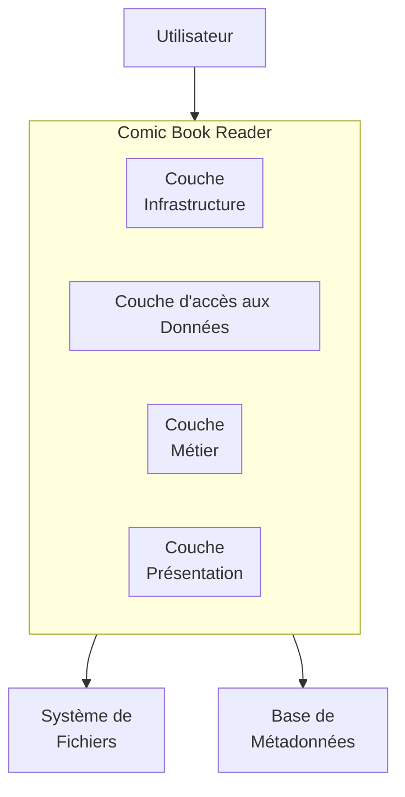

```mermaid
flowchart TD
    %% Acteurs Primaires (côté gauche)
    A[Utilisateur] --> App

    %% Application (grosse boîte centrale)
    subgraph App["Comic Book Reader"]
        subgraph Présentation["Couche 
        Présentation"]

        end

        subgraph Métier["Couche 
        Métier"]

        end

        subgraph Données["Couche d'accès aux Données"]

        end

        subgraph Utilitaire["Couche 
        Infrastructure"]
        end

    end

    %% Acteurs Secondaires (côté droit)
    App --> B[Système de 
    Fichiers]
    App --> C[Base de 
    Métadonnées]

```