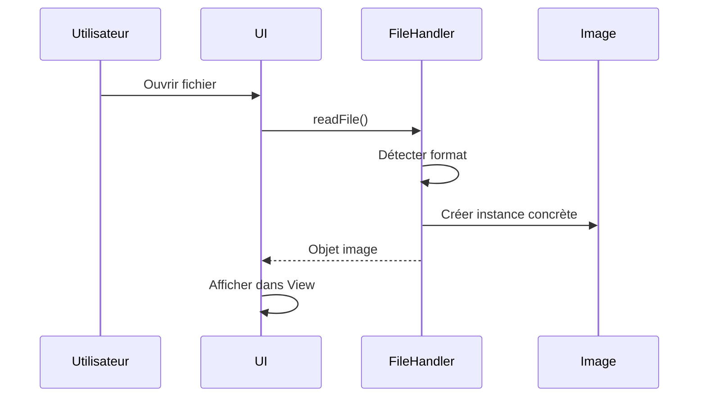

```mermaid
sequenceDiagram
    participant U as Utilisateur
    participant UI as UI
    participant FH as FileHandler
    participant IMG as Image
    
    U->>UI: Ouvrir fichier
    UI->>FH: readFile()
    FH->>FH: Détecter format
    FH->>IMG: Créer instance concrète
    FH-->>UI: Objet image
    UI->>UI: Afficher dans View
```