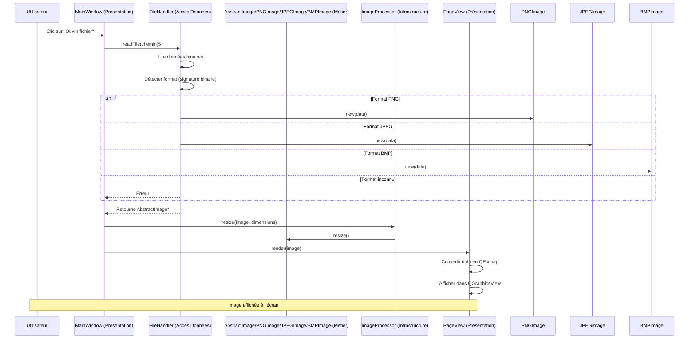

```mermaid
sequenceDiagram
    participant User as Utilisateur
    participant MainWindow as MainWindow (Présentation)
    participant FileHandler as FileHandler (Accès Données)
    participant Image as AbstractImage/PNGImage/JPEGImage/BMPImage (Métier)
    participant ImageProcessor as ImageProcessor (Infrastructure)
    participant PageView as PageView (Présentation)

    User->>MainWindow: Clic sur "Ouvrir fichier"
    MainWindow->>FileHandler: readFile(chemin)5
  
    FileHandler->>FileHandler: Lire données binaires
    FileHandler->>FileHandler: Détecter format (signature binaire)
  
    alt Format PNG
        FileHandler->>PNGImage: new(data)
    else Format JPEG
        FileHandler->>JPEGImage: new(data)
    else Format BMP
        FileHandler->>BMPImage: new(data)
    else Format inconnu
        FileHandler-->>MainWindow: Erreur
    end
  
    FileHandler-->>MainWindow: Retourne AbstractImage*
  
    MainWindow->>ImageProcessor: resize(image, dimensions)
    ImageProcessor->>Image: resize()
  
    MainWindow->>PageView: render(image)
    PageView->>PageView: Convertir data en QPixmap
    PageView->>PageView: Afficher dans QGraphicsView
  
    Note over User,PageView: Image affichée à l'écran
```
